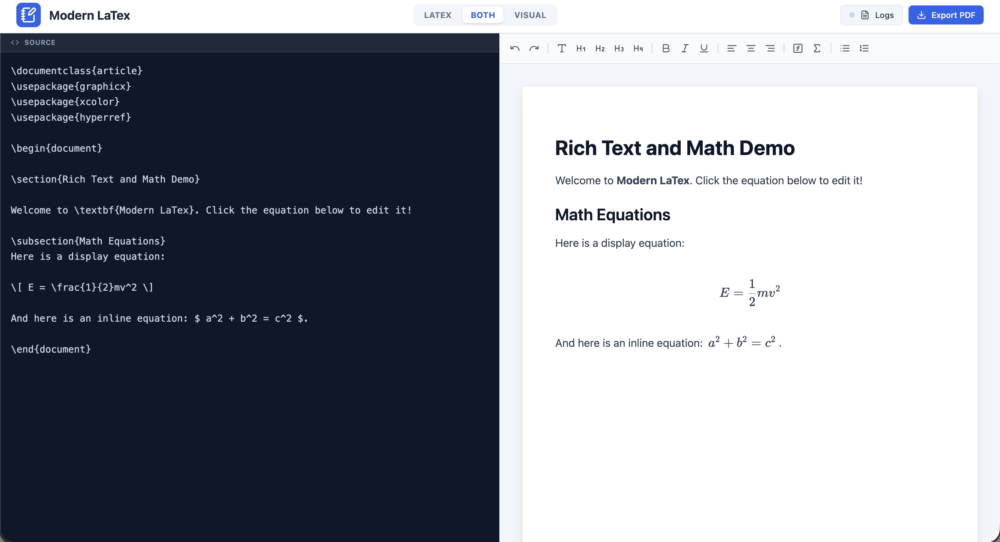

# Modern LaTeX Editor (Texure)

A bidirectional LaTeX + rich-text editor with a visual toolbar, live preview, and one-click PDF export.

- Live demo: https://inmdev.github.io/Modern-LaTex-Editor/

<p align="center">
  
</p>

## Features

- Bidirectional editing: switch between rich-text and LaTeX source (or show both).
- Ribbon toolbar for headings, lists, alignment, links, code, and math input.
- Image import with local caching (IndexedDB).
- Open/save `.tex` using the File System Access API when available (with a download fallback).
- PDF export with compiler logs/diagnostics.

<p align="center">
  
</p>

## Getting started

Prereqs: Node.js 18+ recommended.

```bash
npm install
npm run dev
```

Build and preview:

```bash
npm run build
npm run preview
```

## Testing

```bash
npm test
```

## Configuration

Create `.env.local` from `.env.example`:

```bash
cp .env.example .env.local
```

Environment variables:

- `VITE_ENABLE_RTEX` (default `false`): enables the optional `/api/rtex` dev proxy (fallback compiler).
- `VITE_USE_WASM_LATEX` (default `false`): compile in-browser via a WebAssembly engine (experimental).
- `VITE_WASM_LATEX_MODULE` (optional): ESM module id/URL for the WASM engine.

## GitHub Pages deployment

This repo includes scripts that build a Pages-friendly artifact (sets the Vite base path and generates `dist/404.html` for SPA fallback):

```bash
npm run build:pages
npm run verify:pages
```

Override the default Pages subpath (defaults to `/Modern-LaTex-Editor/`):

```bash
BASE_PATH=/your-repo-name/ npm run build:pages
```

Local Pages-style preview:

```bash
npm run preview:pages
```

## Contributing

Contributions are welcome! Here is how you can help:

- Features & Improvements: Feel free to check the Issues page to suggest new features or pick up existing tasks.

- Reporting Bugs: Please open an Issue and include:

  - Steps to reproduce the bug.

  - Expected behavior vs. actual behavior.

  - Browser and OS information (helpful for debugging).

Submitting Changes: Please submit a Pull Request (PR) for any code changes.

## License

AGPL-3.0 — see `LICENSE`.
